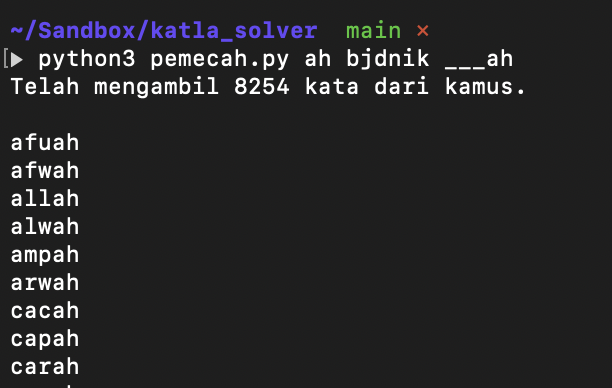

# Pemecah Katla

Upaya nasionalisasi [https://github.com/hakluke/wordlesolver](https://github.com/hakluke/wordlesolver).

## Cara Pakai

Menjalakan naskah program: `python3 solver.py <huruf-huruf dalam katla> <huruf-huruf tidak dalam katla> <penempatan huruf>`

Argumen-argumen dari program:
- `<huruf-huruf dalam katla> adalah huruf-huruf yang kamu ketahui ada pada katla; tuliskan tanpa spasi. contoh: ab`
- `<huruf-huruf tidak dalam katla> adalah huruf-huruf yang kamu ketahui tidak ada pada katla; tuliskan tanpa spasi. contoh: sd`
- `<penempatan huruf> adalah penempatan tata letak huruf-huruf yang kita ketahui saat ini dituliskan, dan yang tidak diketahui ditandai dengan underscore. contoh: aba__`

Meski diatas telah dijalaskan cara pakai, tentu akan lebih mudah jika memakai gambar untuk menjelaskannya:

Ini adalah Katla hari ini:

Tantangan katla hari ini bisa kita selesaikan menggunakan **Pemecah Katla** berdasarkan metode _trial and error_. Misal untuk baris kedua yang berisikan `___ah`:

- `ah` adalah huruf-huruf yang kita ketahui berada pada katla, pada posisi yang tepat. Argumen ini juga bisa kita tuliskan sebagai `ha` karena penempatan tidak berpengaruh.
- `bjdnik` adalah huruf-huruf yang kita ketahui **tidak** berada pada katla. Penempatan huruf pada argumen ini juga tidak berpengaruh.
- `___ah` adalah penempatan huruf secara tepat yang kita ketahui. Penempatan huruf pada argumen ini berpengaruh, tidak bisa dituliskan sebagai `___ha`.

- `auh` adalah huruf-huruf yang kita ketahui berada pada katla, pada posisi yang tepat. Kita tahu bahwa `u` berada pada katla, tetapi kita tidak tau penempatannya pada katla; oleh karena itu bisa kita tuliskan disini (argumen pertama), tetapi tidak bisa kita tuliskan pada penempatan huruf (argumen ketiga)
- `bjdnik` adalah huruf-huruf yang kita ketahui **tidak** berada pada katla. Penempatan huruf pada argumen ini juga tidak berpengaruh.
- `___ah` adalah penempatan huruf secara tepat yang kita ketahui. Penempatan huruf pada argumen ini tetap sama dengan yang awal, akan tetapi karena ada huruf yang _exists_ tetapi kita tidak tau dimana penempatannya: hasil dari pencarian akan berbeda dengan pencarian awal.

Dengan argumen kedua (huruf-huruf yang kita ketahui **tidak** berada pada katla) semakin banyak, maka pencarian semakin tepat.

